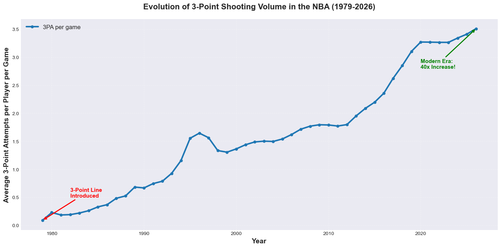
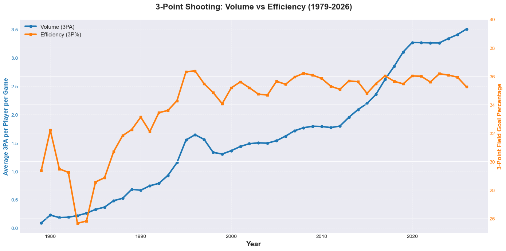
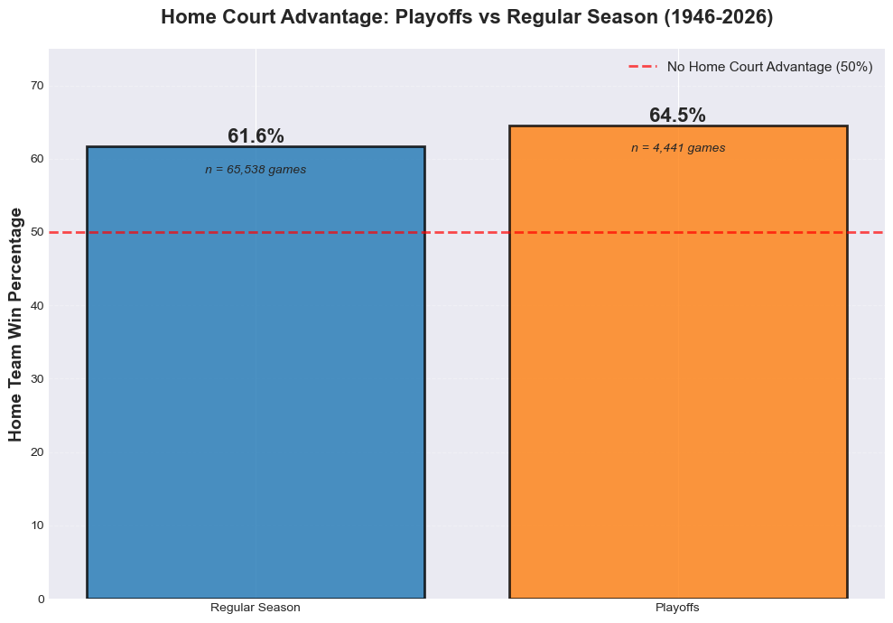

# NBA Historical Data Analysis: 3-Point Revolution & Home Court Advantage

## Project Overview
Exploratory data analysis of historical NBA data (1946-2026) examining two key questions about modern basketball.

## Questions Analyzed

### 1. How has 3-point shooting evolved since its introduction in 1979?
- **Finding**: 40x increase in volume (0.088 → 3.51 attempts per game)
- **Insight**: Post-2000, efficiency plateaued at ~35% while volume exploded, indicating a strategic shift rather than improved shooting ability

### 2. Is home court advantage stronger in playoffs or regular season?
- **Finding**: Home teams win 64.5% of playoff games vs 61.6% of regular season games
- **Insight**: 2.9% stronger advantage in playoffs suggests higher stakes amplify crowd, fatigue, and familiarity factors

## Technologies Used
- **Python**: pandas, numpy, matplotlib, seaborn
- **Environment**: Jupyter Notebook
- **Dataset**: 1.6M+ player-game records, 70K+ games (Kaggle)

## Key Visualizations




## Data Source
[Historical NBA Data and Player Box Scores](https://www.kaggle.com/datasets/eoinamoore/historical-nba-data-and-player-box-scores) - Kaggle

## Project Structure
```
nba-analysis/
├── data/
│   └── [CSV files - download separately]
├── notebooks/
│   └── nba_analysis.ipynb
├── images/
│   ├── 3pt_volume_over_time.png
│   ├── 3pt_volume_vs_efficiency.png
│   └── home_court_advantage.png
└── README.md
```

## How to Run
1. Clone this repository
2. Install requirements: `pip install pandas numpy matplotlib seaborn jupyter`
3. Download dataset from Kaggle and place in `data/` folder
4. Open and run `notebooks/nba_analysis.ipynb`

## Author
**Saiganesh Pothakamuri**

[GitHub](https://github.com/saranp123) | [LinkedIn](https://www.linkedin.com/in/saiganesh-pothakamuri/)
